<div align="center">

<!-- 3D Animated Hero Banner -->


<br/>

<!-- Dynamic Animated Terminal Status -->
<a href="https://github.com/Vikram30069">
  
</a>

<p align="center">
  <a href="https://sites.google.com/ds.study.iitm.ac.in/vikram-banerjee/home"></a>
  <a href="https://www.linkedin.com/in/vikram-banerjee/"></a>
  <a href="https://chitraninstitute.com/preview/index.html"></a>
</p>

</div>

---

###  About Me

Dual-degree Computer Science & Data Science undergraduate building **deterministic multi-agent AI systems**, **contextual anomaly detection pipelines**, and **fault-tolerant backend microservices**.

Currently pursuing:
- 🎓 **BS in Data Science and Applications** at the **Indian Institute of Technology, Madras (IIT Madras)**
- 🎓 **Undergraduate in Computer Science & Engineering (Class of 2027)**

**Leadership & Operations**:
- 🏢 **City Operations Head** @ Boundless (IIT Madras)
- 🏢 **Project Executive & Facilitator** @ Bajaj Foundation (driving partner deals, budget optimization, and project execution across Telangana)
- 🎓 **Ex-Intern** @ IIIT Hyderabad (IIIT-H)

**Beyond Code**:
- 🎹 **8th Grade Certified Musician & Educator** (Indian Fine Arts Association, Visva-Bharati University) with 4+ years of teaching experience mentoring 100+ students across Keyboard, Tabla, Jazz Drums, Harmonium, Octapad, Violin, and Dholak.

---

### 🚨 What I'm Building & Leading

```text
┌──────────────────┬────────────────────────────────────────────────────────────────────────┐
│ Area             │ Focus & Real-World Impact                                              │
├──────────────────┼────────────────────────────────────────────────────────────────────────┤
│ 🚨 RescueNet-AI  │ 10-Agent emergency response orchestrator (CrewAI • FastAPI • AWS)      │
│ 🛡️ datadrishti    │ Paytm IntentGuard: Behavioral UPI anomaly layer (MAD baselines • ML)   │
│ 🏢 Bajaj Fdn     │ Project Executive: Deal negotiation, budget optimization & analytics   │
│ 🎨 Chitran Core  │ Web platform engineering (chitraninstitute.com) & Music Faculty        │
└──────────────────┴────────────────────────────────────────────────────────────────────────┘
```

---

### 🛠️ Featured Engineering Projects

#### 1. [RescueNet-AI — 10-Agent Autonomous Disaster Response Orchestrator](https://github.com/Vikram30069/RescueNet-AI)
*Deterministic multi-agent pipeline designed to eliminate multi-agency communication bottlenecks during rapid-onset urban flooding.*

```mermaid
graph LR
    CALLS[Raw Distress Ingestion] --> A1[1. Incident Understanding]
    A1 --> A2[2. Disaster Intelligence]
    A2 --> A3[3. Survivor Probability]
    A3 --> A4[4. Medical Triage]
    A4 --> A5[5. Priority Scoring]
    A5 --> A6[6. Resource Allocation]
    A6 --> A7[7. Hospital Coordination]
    A7 --> A8[8. Risk Prediction]
    A8 --> A9[9. Twilio Alerts]
    A9 --> A10[10. Master Rescue Plan]
```

[](https://github.com/Vikram30069/RescueNet-AI)
[](https://github.com/Vikram30069/RescueNet-AI)



- **Architecture**: Coordinates 10 specialized CrewAI agents governed by strict Pydantic input/output schemas to prevent hallucination in emergency dispatches.
- **Regional Emergency Datasets**: Ingests and geocodes real Telangana infrastructure registries (100+ vetted hospitals, 108 ambulance depots, fire stations, and NDRF rescue battalions).
- **Automated Dispatches**: Formats and triggers real-time Twilio SMS, IVR synthetic voice calls, and Next.js live geospatial map tracking in under 45 seconds.

---

#### 2. [datadrishti (Paytm IntentGuard) — Contextual Payment Security Layer](https://github.com/Vikram30069/datadrishti)
*Behavioral anomaly detection layer protecting UPI transfers against coercion, distress, and panic-induced financial fraud.*

[](https://github.com/Vikram30069/datadrishti)
[](https://github.com/Vikram30069/datadrishti)

- **The Problem**: Standard binary fraud blockers block safe high-value transfers (e.g. ₹50,000 monthly rent to a known landlord) while missing authorized transactions made under duress or panic.
- **Personal Baseline Analytics**: Evaluates transactions against personal Median and Median Absolute Deviation (MAD) distributions rather than vulnerable arithmetic averages.
- **6 Calibrated Risk Signals**: Evaluates Amount Anomaly (+30), Recipient Novelty (+20), Device Novelty (+20), Time Anomaly (+15), Geo Anomaly (+10), and Velocity Surges (+5).
- **Adaptive Friction Policies**: Maps scores from frictionless 1-tap transfers (0–30) to step-up biometrics (56–80) and out-of-band hold verification (>80).

---

#### 3. [VisionCheck — Industrial Quality & Surface Defect Detection](https://github.com/Vikram30069/ai-image-quality-defect-detection)
*Dual-stage computer vision inspection engine coupling classical morphology with supervised machine learning.*

[](https://ai-image-quality-defect-detection-ps3t.onrender.com)
[](https://ai-image-quality-defect-detection-ps3t.onrender.com/docs)
[](https://github.com/Vikram30069/ai-image-quality-defect-detection)

- **Inspection Pipeline**: Implements a dual-stage architecture: classical spatial morphology (Sobel/Otsu contour localization) identifies physical defect boundaries, while a trained **Random Forest Classifier (93% accuracy)** evaluates 7 optical features.
- **Production Deployment**: Containerized in Docker, deployed on Render with an interactive inspection console and sub-100ms inference API endpoints.

---

#### 4. [Skynet Flight Operations API — Aviation Academy SaaS Backend](https://github.com/Vikram30069/skynet-flight-ops-api)
*High-reliability REST backend enforcing aviation safety compliance, aircraft maintenance dispatch, and training sortie workflows.*

[](https://github.com/Vikram30069/skynet-flight-ops-api)
[](https://github.com/Vikram30069/skynet-flight-ops-api)

- **Domain Compliance**: Implements civil aviation sortie authorization workflows, validating student flight syllabus prerequisites, instructor endorsements, and aircraft airworthiness states (`AIRWORTHY`, `MAINTENANCE_HOLD`, `GROUNDED`).
- **Security & Database**: Role-Based Access Control (RBAC) with JWT tokens enforcing permission scopes across 5 user tiers with an automated PostgreSQL seed pipeline.

---

#### 5. [Chitran Institute — Production Academy Web Platform](https://chitraninstitute.com/preview/index.html)
*Comprehensive digital web platform built for a premier 23-year-old arts and skill academy in Hyderabad.*

[](https://chitraninstitute.com/preview/index.html)

- **Platform Architecture**: Designed a responsive, mobile-first frontend supporting 10+ specialized fine art mediums, curriculum roadmaps, and admissions workflows.
- **Performance & Conversion**: Sub-second DOM load times, interactive course exploration modals, and direct WhatsApp Business API conversion funnels.

---

### 💻 Technical Skills & Tooling

<div align="center">

<a href="https://skillicons.dev">
  
</a>

</div>

<br/>

<table>
  <tr>
    <td width="24%"><strong>AI & Machine Learning</strong></td>
    <td><code>PyTorch</code> • <code>Scikit-Learn</code> • <code>OpenCV</code> • <code>CrewAI (Multi-Agent)</code> • <code>LLM Orchestration</code> • <code>MiniFASNet ONNX</code> • <code>NumPy</code> • <code>Pandas</code></td>
  </tr>
  <tr>
    <td><strong>Backend & Systems</strong></td>
    <td><code>Python (3.11/3.12)</code> • <code>FastAPI</code> • <code>Django</code> • <code>Node.js / Express</code> • <code>Pydantic v2</code> • <code>SQLAlchemy</code> • <code>JWT RBAC</code> • <code>RESTful APIs</code></td>
  </tr>
  <tr>
    <td><strong>Cloud & DevOps</strong></td>
    <td><code>AWS (EC2, Bedrock, Amplify)</code> • <code>Docker</code> • <code>Docker Compose</code> • <code>GitHub Actions (CI/CD)</code> • <code>Linux / Bash</code> • <code>PostgreSQL</code></td>
  </tr>
  <tr>
    <td><strong>Creative & Leadership</strong></td>
    <td><code>Project Facilitation</code> • <code>Deal Negotiation</code> • <code>Budget Optimization</code> • <code>Event Hosting & Emceeing</code> • <code>IFAA 8th Grade Certified Musician</code></td>
  </tr>
</table>

---

### 📊 GitHub Activity & Metrics

<div align="center">


</div>

---

### 🎓 Academic & Certified Credentials

- **Indian Institute of Technology, Madras (IIT Madras)**  
  *Bachelor of Science (BS) in Data Science and Applications*
- **Undergraduate Studies in Computer Science & Engineering**  
  *Class of 2027*
- **Indian Fine Arts Association (IFAA), Visva-Bharati University**  
  *8th Grade Senior Diploma in Music & Classical Instruments*
- **MSME Certified Training Faculty (Govt. of India)**  
  *Fine & Performing Arts Pedagogy*

---

<div align="center">

<p>
  <strong>Vikram Banerjee</strong> • <a href="https://sites.google.com/ds.study.iitm.ac.in/vikram-banerjee/home">Portfolio</a> • <a href="https://www.linkedin.com/in/vikram-banerjee/">LinkedIn</a> • <a href="https://github.com/Vikram30069">GitHub</a>
</p>

</div>
