```mermaid
graph LR
    CALLS[Raw Distress Ingestion] --> A1[1. Incident Understanding]
    A1 --> A2[2. Disaster Intelligence]
    A2 --> A3[3. Survivor Probability]
    A3 --> A4[4. Medical Triage]
    A4 --> A5[5. Priority Scoring]
    A5 --> A6[6. Resource Allocation]
    A6 --> A7[7. Hospital Coordination]
    A7 --> A8[8. Risk Prediction]
    A8 --> A9[9. Twilio Alerts]
    A9 --> A10[10. Master Rescue Plan]
```

<div align="center">

<!-- Animated Header Banner with Glowing Waves & Gradient Title -->


<!-- Animated Dynamic Typing Subtitle -->
<a href="https://github.com/Vikram30069">
  
</a>

<p align="center">
  <a href="https://sites.google.com/ds.study.iitm.ac.in/vikram-banerjee/home"></a>
  <a href="https://www.linkedin.com/in/vikram-banerjee/"></a>
  <a href="https://chitraninstitute.com/preview/index.html"></a>
</p>

</div>

---

### ⚡ Technical Profile

I am an AI/ML and Systems Engineer pursuing a dual-degree track at **Matrusri Engineering College** (B.E. in Computer Science & Engineering) and the **Indian Institute of Technology, Madras (IIT Madras)** (BS in Data Science and Applications).

My engineering work bridges the gap between **theoretical machine learning** and **production-grade software systems**:
- 🤖 **Autonomous Multi-Agent AI**: Designing deterministic agent pipelines with structured schema boundaries, dynamic role assignment, and multi-channel telemetry.
- 🛡️ **Contextual Risk & Anomaly Engines**: Applying non-parametric statistical methods (Median / MAD baselines) to detect fraud and duress in real-time transactions.
- 👁️ **Dual-Stage Computer Vision**: Combining spatial morphological localization with supervised classifiers for automated surface inspection.
- ☁️ **High-Concurrency Cloud Backends**: Architecting asynchronous FastAPI microservices, PostgreSQL relational schemas, JWT RBAC, and Docker containers.

---

### 🚨 Currently Building

```text
┌──────────────────┬────────────────────────────────────────────────────────────────────────┐
│ Project          │ Engineering Focus & Architecture                                       │
├──────────────────┼────────────────────────────────────────────────────────────────────────┤
│ 🚨 RescueNet-AI  │ 10-Agent emergency response orchestrator (CrewAI • FastAPI • AWS)      │
│ 🛡️ datadrishti    │ Paytm IntentGuard: Behavioral UPI anomaly layer (MAD baselines • ML)   │
│ 🎨 Chitran Core  │ Production-grade client academy web platform (chitraninstitute.com)    │
└──────────────────┴────────────────────────────────────────────────────────────────────────┘
```

---

### 🛠️ Featured Engineering Projects

#### 1. [RescueNet-AI — 10-Agent Autonomous Disaster Response Orchestrator](https://github.com/Vikram30069/RescueNet-AI)
*Real-time multi-agent dispatch system designed to solve coordination failure during rapid-onset urban flooding.*

[](https://github.com/Vikram30069/RescueNet-AI)
[](https://github.com/Vikram30069/RescueNet-AI)
[](https://github.com/Vikram30069/RescueNet-AI)



- **Architecture**: Coordinates 10 specialized CrewAI agents governed by strict Pydantic input/output validation schemas to eliminate hallucination in emergency dispatches.
- **Regional Emergency Datasets**: Ingests and geocodes real Telangana infrastructure registries (100+ vetted hospitals, 108 ambulance depots, fire stations, and NDRF rescue battalions).
- **Automated Dispatches**: Formats and triggers real-time Twilio SMS, IVR synthetic voice calls, and Next.js live geospatial map tracking in under 45 seconds.

---

#### 2. [datadrishti (Paytm IntentGuard) — Contextual Payment Security Layer](https://github.com/Vikram30069/datadrishti)
*Behavioral anomaly detection layer protecting UPI transfers against coercion, distress, and panic-induced financial fraud.*

[](https://github.com/Vikram30069/datadrishti)
[](https://github.com/Vikram30069/datadrishti)

- **The Problem**: Standard binary fraud blockers block safe high-value transfers (e.g. ₹50,000 monthly rent to a known landlord) while missing authorized transactions made under duress or panic.
- **Personal Baseline Analytics**: Evaluates transactions against personal Median and Median Absolute Deviation (MAD) distributions rather than vulnerable arithmetic averages.
- **6 Calibrated Risk Signals**: Evaluates Amount Anomaly (+30), Recipient Novelty (+20), Device Novelty (+20), Time Anomaly (+15), Geo Anomaly (+10), and Velocity Surges (+5).
- **Adaptive Friction Policies**:
  - `0–30 (Low Risk)` ➔ **ALLOW**: 1-Tap frictionless transfer.
  - `31–55 (Moderate Risk)` ➔ **INFORM**: Contextual warning banner with 1-tap review.
  - `56–80 (Elevated Risk)` ➔ **STEP-UP**: Mandatory biometric re-authentication & cooling-off delay.
  - `>80 (Severe Risk)` ➔ **BLOCK**: Transaction hold requiring out-of-band telephone clearance.

---

#### 3. [VisionCheck — Industrial Quality & Surface Defect Detection](https://github.com/Vikram30069/ai-image-quality-defect-detection)
*Dual-stage computer vision inspection engine coupling classical morphology with supervised machine learning.*

[](https://ai-image-quality-defect-detection-ps3t.onrender.com)
[](https://ai-image-quality-defect-detection-ps3t.onrender.com/docs)
[](https://github.com/Vikram30069/ai-image-quality-defect-detection)

- **Inspection Pipeline**: Implements a dual-stage architecture: classical spatial morphology (Sobel/Otsu contour localization) identifies physical defect boundaries, while a trained **Random Forest Classifier (93% accuracy)** evaluates 7 optical features (sharpness index, contrast, luminance, noise estimate, blur metric, edge density, and defect count).
- **Production Deployment**: Containerized in Docker, deployed on Render with an interactive inspection console and sub-100ms inference API endpoints.

---

#### 4. [Skynet Flight Operations API — Aviation Academy SaaS Backend](https://github.com/Vikram30069/skynet-flight-ops-api)
*High-reliability REST backend enforcing aviation safety compliance, aircraft maintenance dispatch, and training sortie workflows.*

[](https://github.com/Vikram30069/skynet-flight-ops-api)
[](https://github.com/Vikram30069/skynet-flight-ops-api)

- **Domain Compliance**: Implements civil aviation sortie authorization workflows, validating student flight syllabus prerequisites, instructor endorsements, and aircraft airworthiness states (`AIRWORTHY`, `MAINTENANCE_HOLD`, `GROUNDED`).
- **Security & Database**: Role-Based Access Control (RBAC) with JWT tokens enforcing permission scopes across 5 user tiers (Admin, Dispatcher, CFI, Instructor, Student) with an automated PostgreSQL seed pipeline.

---

#### 5. [PaySphere — Intelligent Payment Simulation & Incident Dispatch](https://github.com/Vikram30069/paysphere)
*Fintech transaction processing simulation featuring explainable risk evaluation and automated emergency telephonic response.*

[](https://github.com/Vikram30069/paysphere)

- **Automated Incident Response**: Triggers real-time Twilio SMS verification codes and programmable voice IVR phone calls when a simulated payment exceeds critical anomaly thresholds.
- **Interactive Security UI**: Features an interactive 3D holographic balance card with mouse-tracking tilt, circular SVG risk gauge (0–100), and transaction forensic audit drawers.

---

#### 6. [Smart Attendance & Liveness Verification System](https://github.com/Vikram30069/smart-attendance-using-face-recognition)
*Enterprise attendance platform integrating real-time computer vision, deep learning anti-spoofing, and geolocation constraints.*

[](https://github.com/Vikram30069/smart-attendance-using-face-recognition)

- **Edge Deep Learning**: Defends against 2D printed photographs, video screens, and mask replays using a **MiniFASNet ONNX neural network** for real-time texture liveness detection.
- **Institutional Governance**: Combines facial landmark matching with browser GPS geofence radius checks, automated timetable seeding, and role-based student/faculty dashboards.

---

### 💻 Technical Stack & Tooling

<div align="center">

<!-- Sleek Dark Themed Icon Badges -->
<a href="https://skillicons.dev">
  
</a>

</div>

<br/>

<table>
  <tr>
    <td width="24%"><strong>AI & Machine Learning</strong></td>
    <td><code>PyTorch</code> • <code>TensorFlow</code> • <code>Scikit-Learn</code> • <code>OpenCV</code> • <code>CrewAI (Multi-Agent)</code> • <code>LLM Orchestration</code> • <code>MiniFASNet ONNX</code> • <code>NumPy</code> • <code>Pandas</code></td>
  </tr>
  <tr>
    <td><strong>Backend & Systems</strong></td>
    <td><code>Python (3.11/3.12)</code> • <code>FastAPI</code> • <code>Django</code> • <code>Node.js / Express</code> • <code>Pydantic v2</code> • <code>SQLAlchemy</code> • <code>JWT RBAC</code> • <code>RESTful APIs</code></td>
  </tr>
  <tr>
    <td><strong>Data & Persistence</strong></td>
    <td><code>PostgreSQL</code> • <code>SQLite</code> • <code>Redis (Basics)</code> • <code>Data Cleaning & ETL</code> • <code>PySpark (Foundations)</code></td>
  </tr>
  <tr>
    <td><strong>Cloud & Infrastructure</strong></td>
    <td><code>AWS (EC2, Bedrock, Amplify)</code> • <code>Docker</code> • <code>Docker Compose</code> • <code>GitHub Actions (CI/CD)</code> • <code>Linux / Bash</code> • <code>Render / Vercel</code></td>
  </tr>
  <tr>
    <td><strong>Web & Client Systems</strong></td>
    <td><code>Next.js 14/15</code> • <code>TypeScript</code> • <code>JavaScript</code> • <code>Tailwind CSS</code> • <code>Production Platform Engineering</code></td>
  </tr>
</table>

---

### 📊 GitHub Activity & Metrics

<div align="center">


</div>

---

### 🎓 Academic Background

- **Matrusri Engineering College** (Affiliated with Osmania University)  
  *Bachelor of Engineering (B.E.) in Computer Science and Engineering*
- **Indian Institute of Technology, Madras (IIT Madras)**  
  *Bachelor of Science (BS) in Data Science and Applications*

---

<div align="center">

<!-- Animated Wave Footer -->


<p>
  <strong>Vikram Banerjee</strong> • <a href="https://sites.google.com/ds.study.iitm.ac.in/vikram-banerjee/home">Portfolio</a> • <a href="https://www.linkedin.com/in/vikram-banerjee/">LinkedIn</a> • <a href="https://github.com/Vikram30069">GitHub</a>
</p>

</div>
